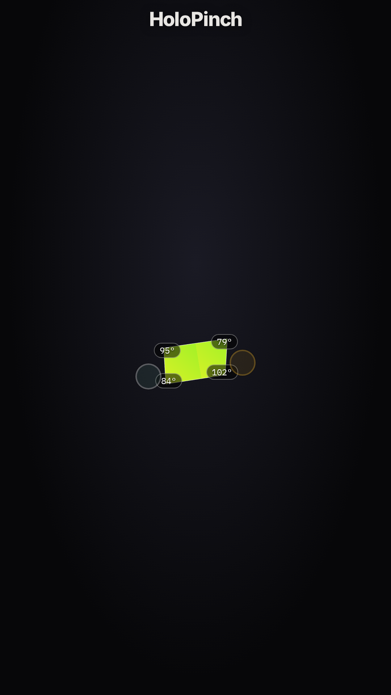

# HoloPinch

**Hold light** between your hands — MediaPipe + WebGL in a plain browser tab. No app, no account, no backend. Shape rides one continuous **flatness** continuum (opaque foil card ↔ translucent crystal bar).

**Live:** https://holopinch.lizliz.xyz/



**Motion loop (5s silent, 9:16):**  
[`public/media/holopinch-loop-9x16.webm`](public/media/holopinch-loop-9x16.webm) · [`mp4`](public/media/holopinch-loop-9x16.mp4)  
Live on product: https://holopinch.lizliz.xyz/media/holopinch-loop-9x16.webm

## Motion capture (for social)

```
https://holopinch.lizliz.xyz/?motion=1
```

Auto-plays the card→bar continuum with chrome stripped (`capture-clean`). Primary distribution asset is this **5s silent loop** (9:16), not the static OG card. See `docs/AUDIT-audience-resonance-v2.md`.

## Controls

| Input | Desktop | Touch |
|---|---|---|
| Move hands | Drag the orbs | Drag the orbs |
| Pinch open | Scroll wheel | Two-finger vertical drag |
| Finger spread | Shift + scroll | Two-finger horizontal drag |
| Camera | Start camera → pinch thumb+index | Same |

## Stack

Vite · TypeScript · three.js · MediaPipe HandLandmarker (lazy-loaded on camera start)

## Run / build

```bash
npm install
npm run dev    # http://localhost:5188
npm run build  # → dist/
```

Camera needs **HTTPS** (or localhost). If permission is blocked, use Demo.

## Docs

- `docs/DESIGN.md` — brand + asset briefs (motion > OG > favicon)
- `docs/AUDIT-audience-resonance-v2.md` — distribution priority audit
- `docs/INCIDENT-asset-cache.md` — custom-domain Origin/cache footgun
- `PRD.md` — product requirements

## Deploy

Cloudflare Pages, Git-connected (build on push). No direct upload.

Post-deploy check (real browsers send `Origin`):

```bash
curl -sSI -H 'Origin: https://holopinch.lizliz.xyz' \
  "https://holopinch.lizliz.xyz/assets/<hashed>.js" | grep -i content-type
# expect: application/javascript
```

## License

MIT — see `LICENSE`.
